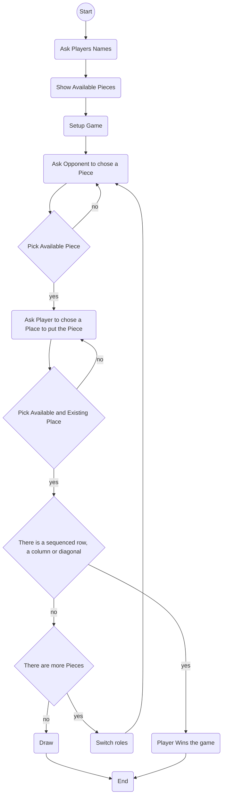

# **Jogo Galo Da Velha**

### **Autoria:**

| Nome | Número |
| - | - |
| Gonçalo Sampaio | 22306825 |
| João Nogueira | 22304016 |

**Gonçalo Sampaio:**
 - Setup do repositório.
 - Classe que avalia as condições de vitória.
 - Classe que faz a gestão do jogo e dos turnos.
 - Readme
  
**João Nogueira:**
 - Classe das Peças do jogo
 - Classe do tabuleiro
 - Classe que gere o setup inicial do jogo e que cria as peças necessárias
 - Fluxograma
---

**Repositório Git:** [GitHub](https://github.com/Goncalo-Sampaio/GaloDaVelha.git)

---

### **Arquitetura da Solução:**
**Program.cs:**
- Apenas instancia um novo jogo e inicia o jogo;

**Game.cs:**
- Método Start onde a maior parte da lógica do jogo irá correr:
  - Começa por instanciar um setup que irá retornar as variáveis essenciais para o jogo;
  - Começa o loop principal do jogo:
    - Mostra o estado do jogo;
    - Gere os turnos e escolhas dos jogadores;
    - Recebe uma variável que diz se o jogador ganhou o jogo;
      - O jogo acaba caso o jogador ganhe;
    - Loop acaba passados 16 turnos;
  - Mostra uma mensagem de fim de jogo dependendo do resultado:
    - Jogador 1 vence;
    - jogador 2 vence;
    - Empate;

**ConditionsChecker.cs:**
- Itera pelas 4 características possíveis;
- Em cada iteração, itera também pela linha e coluna da peça escolhida, assim como pelas diagonais;
- Caso existam 4 peças com a mesma características na mesma linha, coluna ou diagonal, devolve true, indicando que o jogador ganhou;
- Caso contrário, devolve false e o jogo continua;

**Setup.cs:**
- Pede os nomes aos jogadores;
- Instancia o tabuleiro;
- Cria as 16 peças com as características certas;
- Devolve tudo isto ao loop principal do jogo;
- Mostra as instruções do jogo aos jogadores;

**Piece.cs:**
- Classe de cada peça:
  - Tem as variáveis das peças;
  - Tem o construtor;
  - Tem Getters para cada uma das variáveis;

**Board.cs:**
- Classe do tabuleiro:
  - Tem as variáveis do tabuleiro;
  - Tem o construtor que define os espaços do tabuleiro como um array multidimensional de 4 espaços;
  - Tem Getters para as variáveis;
---

### **Fluxograma:**

### **Referências:**
 - [C# Microsoft](https://learn.microsoft.com/pt-pt/dotnet/csharp/)
 - [Stack Overflow](https://stackoverflow.com/)
 - [Free Code Camp](https://www.freecodecamp.org/)
 - [Mermaid](https://mermaid.js.org/syntax/flowchart.html)